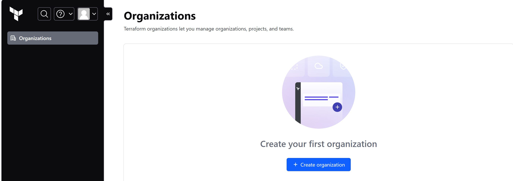
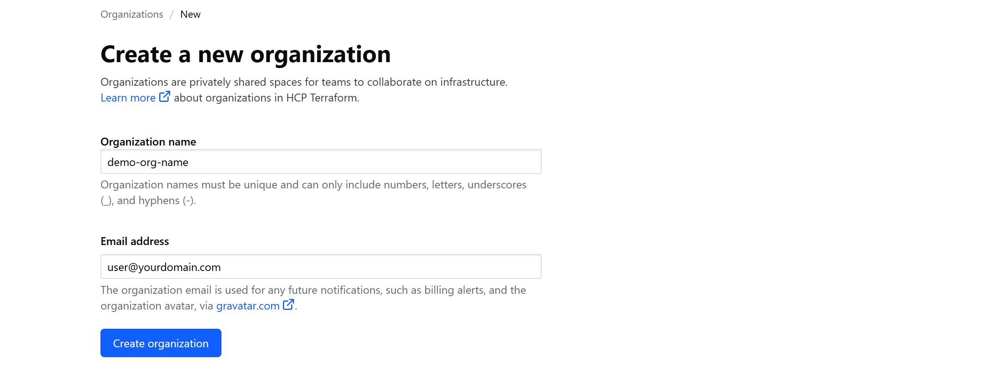
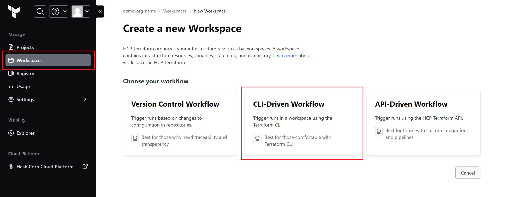
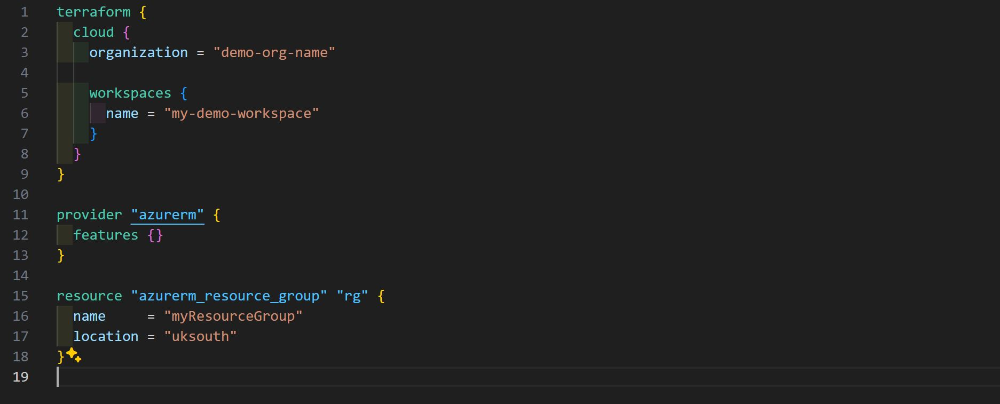
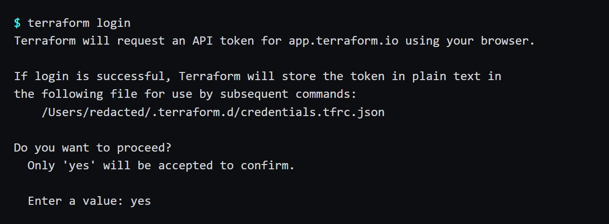
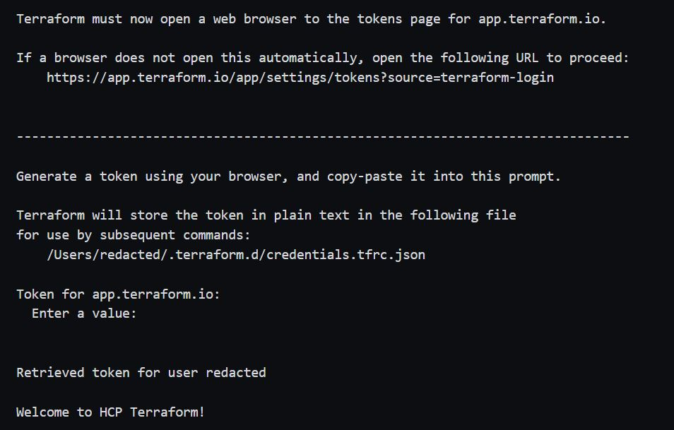

###### TL;DR

* *Terraform Cloud Workspaces simplify state management and enhance collaboration and version control through an intuitive GUI.*
* *Terraform state is a snapshot of infrastructure at a given point in time, mapping Terraform configurations to real-world resources.*
* *Traditional state management approaches, such as storing state files locally or on a shared file system, can lead to issues like corruption, merge conflicts, and state drift.*
* *Terraform Cloud Workspaces offer a centralized solution by storing state files in the cloud, providing access to the latest version of the state and state locking to prevent conflicts.*
* *It also allows for versioning infrastructure and provides an easy-to-use GUI for managing resources with features like state locking, versioning, and a user-friendly interface.*
* *Terraform Cloud Workspaces streamline infrastructure management and make it more accessible, easy to restore different versions of you infrastructure, plus its free to get started. 😄*

#### Overview

Formula D, a car racing motorsport is such a thrill to watch for most folks, even if you are not a fan. It involves not just getting across the finish line but also scoring points in the process by drifting plus a mix of driving styles.

With Terraform, a widely used Infrastructure as Code(IaC) tool, experiencing 'drift' is far from enjoyable, hence the ominous phrase 'TERRAFORM DRIFT OF DEATH'.

In the realm of Infrastructure as Code (IaC), managing the state of your infrastructure is as vital as the infrastructure itself. This post brings exciting news that makes using and managing Terraform not just essential, but also enjoyable.

Terraform employs a concept known as "state" to track the resources it manages. This state is a text file, auto-created from your Terraform configuration during the initial run, and stored within your workspace. As your configuration evolves, so does the state, providing an accurate representation of your actual infrastructure.

Terraform Cloud has a feature that not only revolutionizes state management, but also simplifies, enhances collaboration and version control, all through an intuitive GUI. This article delves deeper into this game-changing feature.

#### Understanding Terraform State

As explained above, Terraform state is a snapshot of your infrastructure at a given point in time. It maps your Terraform configurations to the actual resources, ensuring that Terraform knows what it is managing and how to update those resources without causing conflicts or duplications.

The state file is a file that stores your terraform state as text. By default, this file is saved on the file system of the host where Terraform is running.

It's crucial to keep this state file synchronized with your actual infrastructure. If they fall out of sync, you'll encounter discrepancies, also known as state drift.

#### The Pain of State Management

##### Local State

Traditionally, Terraform stores state files locally. While this approach works well for individual use, but it can quickly become a bottleneck for teams. Issues such as state file corruption, merge conflicts, and the dreaded "state drift" (where the state file no longer accurately reflects the actual infrastructure) can occur.

Since the state is stored on the host system's file system, collaboration becomes challenging. Each user ends up with a different copy of the state file, leading to inconsistencies. This approach is mostly recommended for local experimentation.

However, as your infrastructure and team grow, managing this state file can become increasingly complex due to frequent merge conflicts and drifts.

These limitations of using local storage led to the development of remote state management.

##### Remote State

In contrast to local state management, remote state involves storing the state files in a shared, remote location. This could be an AWS S3 bucket, an Azure storage account, or any other cloud storage service. Remote state allows team members to effectively share the same state file, promoting consistency across the infrastructure.

While remote state management significantly improves collaboration, it also introduces its own set of challenges:

1. **Bootstrapping Problem:** If your Infrastructure as Code (IaC) setup requires a remote state, you'll need to describe the remote state storage (like an S3 bucket or Azure Storage account) in your code. This creates a "chicken and egg" situation, as the storage account itself will also require its own state management.
2. **Access Management:** Centralized storage locations require sharing access keys or credentials with team members. If not handled carefully, this can pose a security risk.
3. **Sensitive Information:** Terraform state files can contain sensitive data, such as secrets or access keys. If these files are not properly secured, unauthorized access could lead to data breaches or system compromises.
4. **Direct Interaction:** HashiCorp, the creator of Terraform, recommends against directly modifying or interacting with the state file. This can be challenging when changes to the state are necessary.

Understanding these potential issues and incorporating them into your Infrastructure as Code (IaC) strategy is crucial. I will now walk you through the process of eliminating the above concerns.

#### Terraform Cloud Workspaces to the Rescue

Terraform Cloud workspaces offer a centralized solution for state management. By storing state files in the cloud, it ensures that everyone on the team has access to the latest version of the state and easy version rollback via a GUI interface. It also provides state locking, preventing concurrent executions that could lead to conflicts. With Terraform Cloud, you do not need a third party storage tool to manage the state of you infrastructure.

#### Terraform Cloud Workspaces: A Modern Solution for State Management

Terraform Cloud Workspaces offer a centralized solution for managing state. By storing state files in the cloud, they ensure that all team members have access to the most up-to-date state version. This setup also facilitates easy version rollback through a user-friendly graphical user interface.

Key features of Terraform Cloud Workspaces include enhanced security measures, manual state lock/control to prevent conflicting operations, and Single Sign-On (SSO) integration with your organization.

With Terraform Cloud, you can eliminate the need for a third-party storage solution to manage your infrastructure's state, and there's also no requirement to define the "state backend" in your code.

Terraform Cloud significantly simplifies the overall process!

#### Getting Started with Terraform Cloud

1. **Sign Up**: Visit the [Terraform Cloud website](https://app.terraform.io "Terraform Cloud") and create your [free account](https://app.terraform.io/public/signup/account).
2. **Activate Your Account**: After signing up, you'll receive an email with a link to activate your account. Follow this link to complete the activation process.
3. **Create or Join an Organization**: Once you've logged in, you'll be directed to a page where you can either create a new organization or join an existing one, if you've been invited by a colleague.

   

**4. Create Workspaces**: Define workspaces for different environments or projects. There are three types of workspaces, but for this guide, select the **CLI driven** one. For more information on workspace types and their uses, refer to my other article on same.

**5. Connect Your Configuration to Your Workspace:** Replace the existing Terraform block in your configuration with the code provided below. Leave the other settings as default.

Update the following settings:

* Execution Mode: Set this to `local`. This setting ensures that Terraform runs on your local machine and not on the Terraform Cloud machines.
* Auto-apply: Set this to `Off`.
* Auto-apply Run Triggers: Set this to `Off`.

**6. Update the terraform block with your worksopace configuration:**

I have a configuration to create a Resource Group in Azure, here is what it looks like after adding the code above to it:

**7. Login to Terraform Cloud**

Before running your terraform commands terraform, you need to authenticate to terraform cloud, run terraform login as shown below, (Note do note expose your credentials like this in real world scenario) find the different authentication methods as recommneded by hasicorp [here](https://developer.hashicorp.com/terraform/tutorials/cloud-get-started/cloud-login "Terraform Cloud CLI Login").

**8. Generate a Terraform Cloud token**

Entering yes in the terminal will automatically open a browser window to the Terraform login screen, and once logged in will present a token geneation page:

Once you paste the token in the terminal, you will be authenticated to terraform.

**9. Execute**: Run Terraform configurations with the peace of mind that the state is safely managed and versioned in the cloud:

`terraform init`

`terraform plan`

`terraform apply`

**10. Browse through the state in your Terraform Cloud portal**

Click on your workspace and then staes, you will see there is a new state in the workspace, if you expand it, you will see the details of the associated resources.

#### **Versioning Your Infrastructure**

One of the standout features of Terraform Cloud Workspaces is the ability to create versions of your infrastructure. Each run is logged, and the state is versioned, allowing you to roll back to previous versions if needed. This feature is akin to having a "time machine" for your infrastructure, providing a safety net for any changes made.

See multiple states below:

You can select a previous version and roll back to it, scroll to the bottom of the workspace states page, and click on "Rollback to this State Version"

#### Conclusion

Terraform Cloud Workspaces removes the complexity of state management, making your IaC more accessible and less error-prone. With features like state locking, versioning, and an easy-to-use GUI, it's no wonder that teams are flocking to this solution to manage their Terraform state.

Remember, while Terraform Cloud takes away much of the state management pain, it's still important to understand the underlying principles to make the most of this powerful feature. Happy ~~drifting~~ coding!

---

*This post aims to demystify Terraform state management and highlight the benefits of using Terraform Cloud Workspaces. For a more in-depth guide and best practices, be sure to check out the official [HashiCorp blog]() and [support articles]().*

(1) Using Terraform Cloud Remote State Management - HashiCorp. [https://www.hashicorp.com/blog/using-terraform-cloud-remote-state-management](https://www.hashicorp.com/blog/using-terraform-cloud-remote-state-management).

(2) Advanced Techniques for Terraform Workspace Management in Terraform Cloud. [https://support.hashicorp.com/hc/en-us/articles/25012187388435-Advanced-Techniques-for-Terraform-Workspace-Management-in-Terraform-Cloud](https://support.hashicorp.com/hc/en-us/articles/25012187388435-Advanced-Techniques-for-Terraform-Workspace-Management-in-Terraform-Cloud).

(3) Here is a good terraform series by .........

(3) Here is a good Terraform series by [@kunlesanni](https://dev.to/username).



